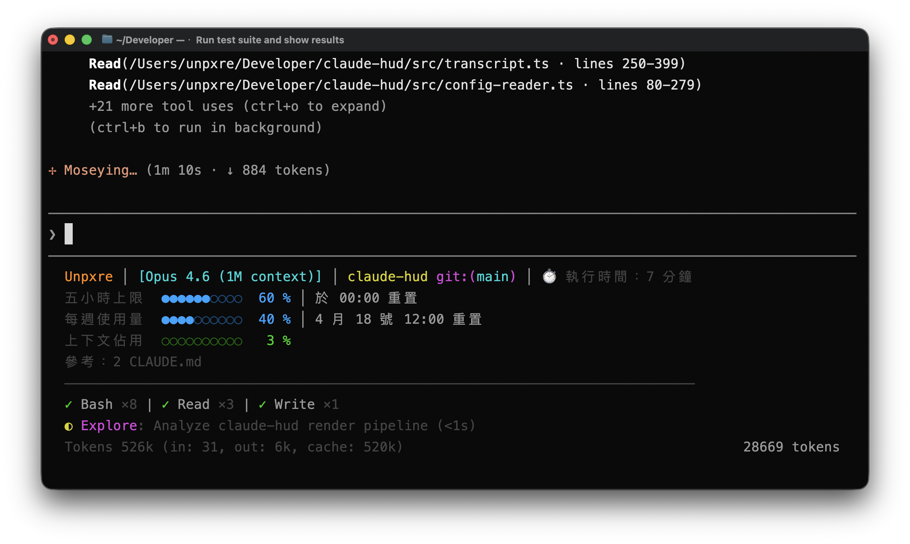

# Claude HUD

Claude Code 的即時狀態列插件 — 顯示上下文用量、工具活動、代理狀態與待辦進度。

> Fork 自 [jarrodwatts/claude-hud](https://github.com/jarrodwatts/claude-hud)，包含繁體中文在地化與客製化調整。

[](LICENSE)



## 安裝

在 Claude Code 中依序執行：

**步驟 1：加入插件來源**
```
/plugin marketplace add UnpxreTW/claude-hud
```

**步驟 2：安裝插件**
```
/plugin install claude-hud
```

> ⚠️ 安裝完成後，請依照畫面提示執行 `/reload-plugins` 載入插件。

**步驟 3：設定狀態列**
```
/claude-hud:setup
```

完成！

> ⚠️ 如果 HUD 沒有出現，請重新啟動 Claude Code。

---

## 功能

Claude HUD 讓你即時掌握 Claude Code session 的狀態。

| 顯示內容 | 說明 |
|----------|------|
| **專案路徑** | 目前所在專案（可設定 1-3 層目錄） |
| **上下文用量** | context window 使用率 |
| **工具活動** | 查看 Claude 正在讀取、編輯、搜尋的檔案 |
| **代理追蹤** | 正在執行的 subagent 及其狀態 |
| **待辦進度** | 即時追蹤任務完成度 |

詳細的顯示範例與佈局說明請參考[上游文件](https://github.com/jarrodwatts/claude-hud#what-you-see)。

---

## 客製化內容

此 Fork 基於上游版本進行以下調整：

| 項目 | 說明 |
|------|------|
| **繁體中文（zh-TW）** | 新增繁體中文在地化語系 |
| **量表字元** | `█░` → `●○` |
| **每週用量獨立行** | 五小時與每週用量分開顯示 |
| **重置時間格式** | 倒數改為時鐘格式（`於 HH:MM 重置`、`M 月 D 號 HH:00 重置`） |
| **百分比對齊** | 固定寬度格式化，數字對齊 |
| **分隔線** | configure 可開關分隔線 |
| **customLine 前置** | 自訂文字移至狀態列最前方 |
| **環境資訊前綴** | 加上「參考：」標題 |
| **上限量表** | 用量達 100% 時維持量表顯示 |

完整的覆寫定義請參考 [.unpxre/overrides.md](.unpxre/overrides.md)。

### 一鍵套用推薦設定

```
/claude-hud:Unpxre
```

包含 statusLine 設定 + 繁體中文 + 全功能啟用的預設配置。

---

## 參考

- [顯示範例與佈局說明](https://github.com/jarrodwatts/claude-hud#what-you-see)
- [完整設定選項](https://github.com/jarrodwatts/claude-hud#options)
- [疑難排解](https://github.com/jarrodwatts/claude-hud#troubleshooting)
